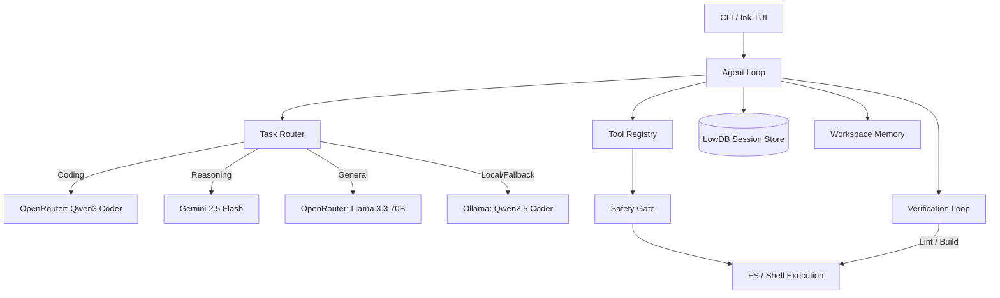
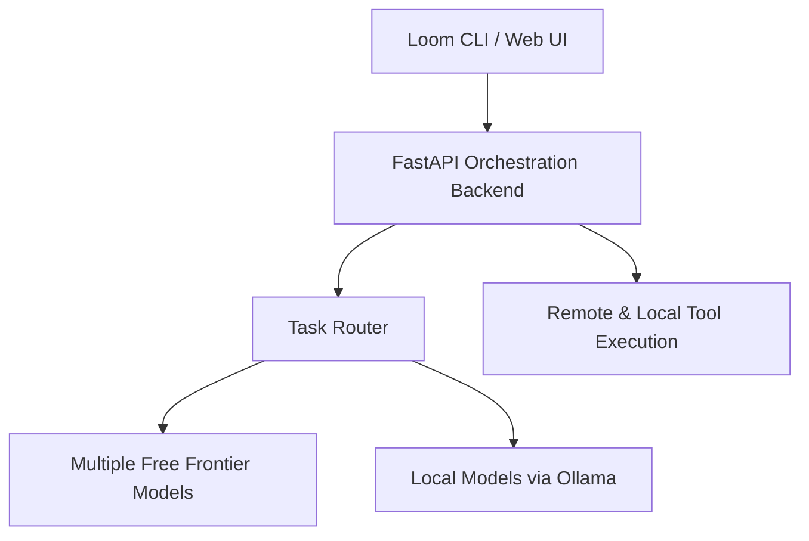

# Architecture

Loom is designed as a local-first multi-model AI coding agent orchestrator. It uses a robust TypeScript + Node.js architecture with an interactive Ink-based terminal UI (TUI).

## Current Architecture

The current architecture is CLI-focused and runs entirely locally on the user's machine, interacting directly with LLM providers.

### Components
1. **CLI / TUI**: Handles user input, slash commands, and streaming output visualization.
2. **Task Router**: Classifies the prompt and automatically selects the optimal provider/model combination.
3. **Agent Loop**: The core executor. Formats history, manages native function calls, and iterates until the task is complete.
4. **Fallback Chain**: If a primary cloud model hits a rate limit (429) or transient error, the agent automatically falls back to a secondary cloud model, and finally to local Ollama.
5. **Safety Gate**: Prompts the user for confirmation before executing potentially destructive commands.

## Future Architecture Direction

Loom is evolving towards a decoupled architecture, introducing a **FastAPI orchestration backend** to enable remote API access, centralized deployments, and better team collaboration.

### Planned Evolutions
- **Render Deployment**: Deploying the orchestration backend to Render.
- **Environment Management**: Robust remote environment variable configuration.
- **Remote API Access**: Exposing agent capabilities via a REST API.
